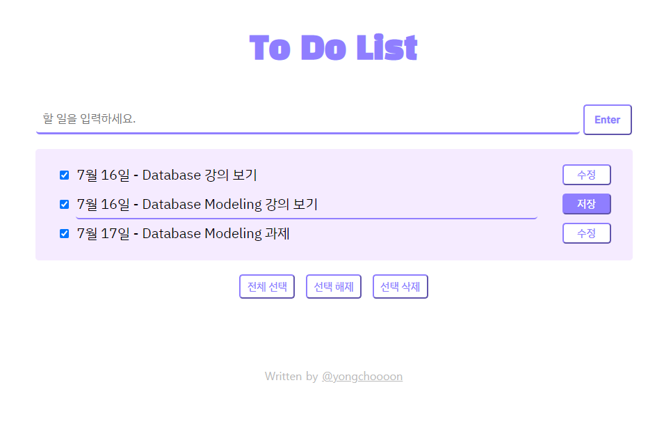
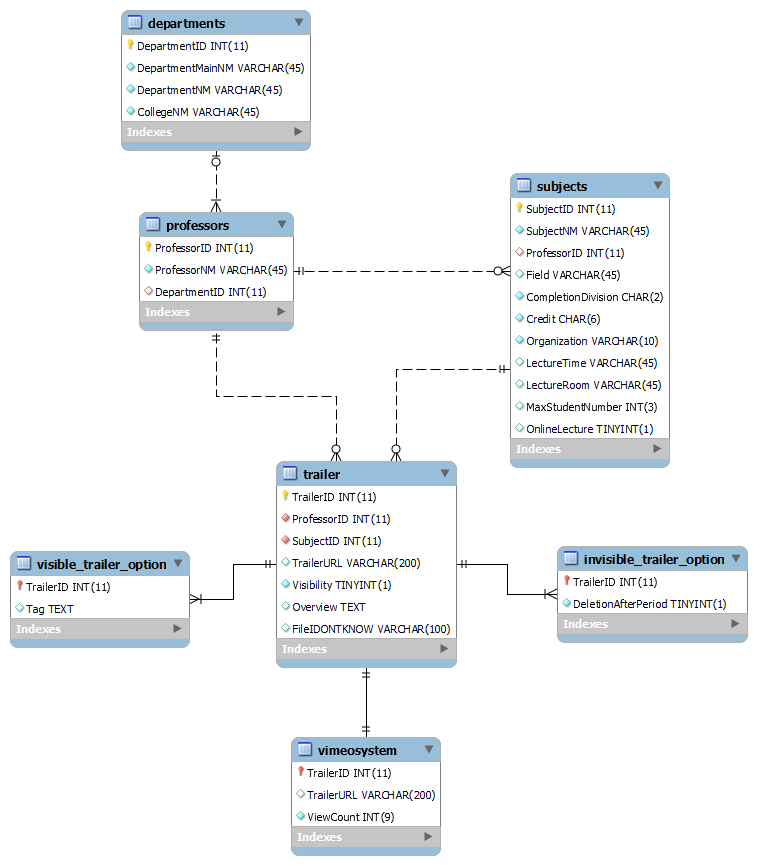

# :fire: SME SW Bootcamp
- camper : [yongchoooon](https://github.com/yongchoooon)
## Week 2
- JavaScript, jQuery
- Database
- Database modeling
### Assignment 1 - To Do List

- My Assignment
  - [index.html](./ToDoList/index.html)
  - [main.css](./ToDoList/main.css)
  - [todolist.js](./ToDoList/todolist.js)

### Assignment 2 - Database modeling with Workbench

- My Assignment
  - [Trailer_System.mwb](./DB_Modeling/Trailer_System.mwb)
  - Table 생성 : [Create_Table](./DB_Modeling/Create_Tables.sql)
  - Table에 data 삽입 : [Insert_Values](./DB_Modeling/Insert_Values.sql)

### 아쉬운 점 - DB Modeling
- 예시로 주어진 강의 트레일러 시스템에서 교수직번과 교과명번호로 교수자명과 교과목명을 검색하는 기능이 구현되어 있는데, 이 기능은 DB에서 어떻게 접근해야 하는지 모르겠다.
- `vimeosystem`이라는 table은 내가 편의를 위해서 만든 테이블이고, 실제로는 Vimeo 웹 서버를 의미한다. Vimeo가 해당 트레일러에 대한 URL을 가지고 있고, 그 URL에 대한 조회수를 가지고 있다는 것을 본 과제에서 Table로 표현했다. 
- 트레일러 업로드 시에 교수가 강의정보와 함께 강의파일을 업로드하면 Vimeo에서 URL을 만들어준다고 하는데, 만들어진 URL은 어느 Table에 저장되어야 하는지 모르겠고, 전반적으로 이 기능 또한 DB에서 어떻게 접근해야 하는지 모르겠다.
  - 로직을 생각해보면,
    - 트레일러를 한 번 Vimeo에 업로드하면 URL을 받아서 트레일러 테이블에 Insert하게 되는 거니까, 트레일러 table에서 Vimeo 사이트에 데이터를 전달할 때(=업로드를 할 때) 강의정보와 강의영상파일을 담아서 전달하는 어떤 `트랜잭션..?` 같은 게 있어야 할 것 같다. 
    - 사실 `트랜잭션`에 대한 개념 정의가 제대로 안 되어 있다. 
    - 또한 교수는 Vimeo에 저장된 트레일러 Count 수를 알 수 있어야 하고, 강의를 업로드한 이후 수정과 삭제가 가능해야 하기 때문에 `트레일러와 Vimeo 사이에 정보를 전달하는 뭔가`가 있어야 한다고 생각한다.. 근데 그게 어떤 형태인지는 전혀 모르겠다..
  - 그래서 정말 모르겠다.
- 트레일러를 업로드 할 때 강의 공개/비공개 여부도 입력할 수 있는데, 공개 선택시에는 태그를 입력할 수 있고, 비공개 시에는 수강신청기간 이후 삭제 여부를 입력할 수 있다.
  - 이걸 identifying한 relationship을 가지는 2개의 table, 즉 공개 table과 비공개 table을 만들어 구현했는데 이렇게 하는 방식이 맞는건지 모르겠다.
  - 사용자가 공개 여부를 선택했다면, 폼에서는 태그를 입력할 수 있도록 하고, 입력된 태그는 TrailerID로 연결된 visible_trailer_option table에 저장되도록 하는건데.. 이렇게 하면 되는건지 모르겠다..